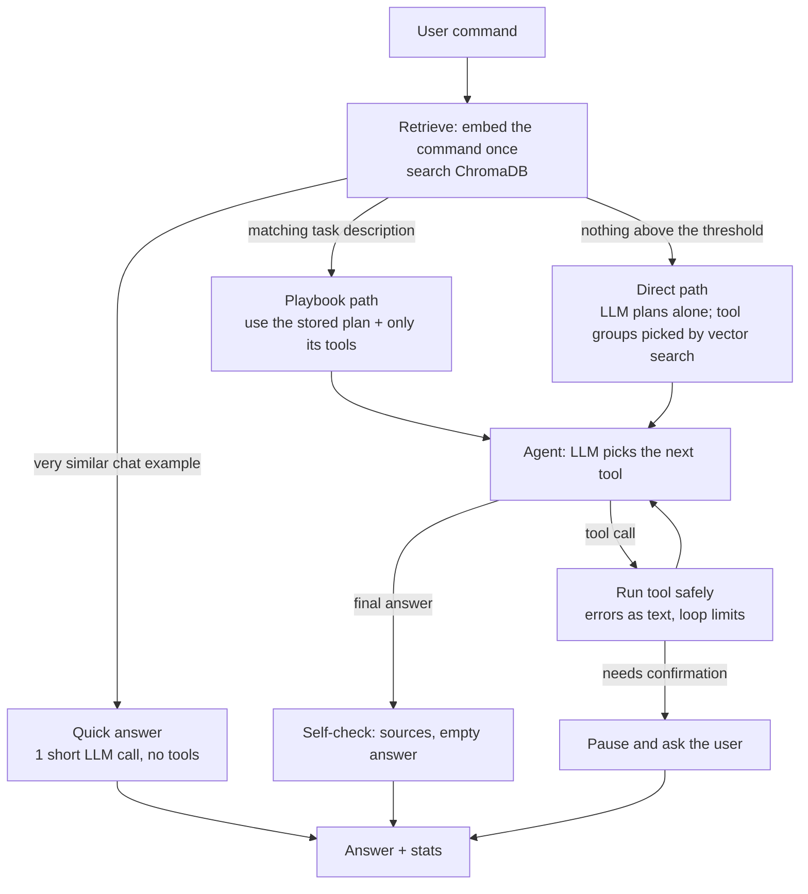

# Nexus Agent

An agentic AI assistant that runs fully on your own machine. You give it a command in plain
language. It searches a vector database for relevant knowledge, plans the task, uses tools
(web research, a browser, a smart web scraper, document and invoice reading, data analysis
and charts, email, memory) and returns the result with a visible log of every step.

**Stack:** Ollama (local LLM + embeddings) · LangGraph (agent loop) · LangChain (tools, retriever)
· ChromaDB (vector DB) · Selenium (browser + scraping) · FastAPI (4 endpoints) · Streamlit (UI)

---

## How it works



### Why RAG makes a small local model faster and more accurate

| Path | When | What it saves |
|---|---|---|
| **Quick** | A stored chat example is almost the same question | No tools, no planning. One short call |
| **Playbook** | A stored task description matches | Skips the planning step. The LLM sees only the 3 to 7 tools the task needs, so it picks the right one more often |
| **Direct** | Nothing relevant is stored | Fallback: the LLM plans on its own. Tool groups are still chosen by vector search, so it never sees all 25 tools |

Documents you add are retrieved the same way and answers cite them (`[file, page N]`).
`GET /stats` reports success rate, time and tokens **per path**, so you can show with your own
numbers whether the vector DB helps.

---

## The 4 endpoints

| Method | Endpoint | Purpose |
|---|---|---|
| POST | `/chat` | Talk to the agent. Form fields: `message`, `session_id` (optional), `file` (optional attachment) |
| POST | `/knowledge` | Add knowledge: `type=chat` (question + answer), `type=task` (title, steps, tools, example commands), `type=document` (file upload or text) |
| GET | `/health` | Ollama + models, vector DB counts, SQLite, Selenium |
| GET | `/stats` | Total tasks, successful, failed, total tokens, average time, RAG hit rate, per-path performance, top tools, recent tasks |

Interactive API docs: http://localhost:8000/docs

---

## Tools (25, in 8 groups)

| Group | Tools |
|---|---|
| Web research | `web_search`, `web_read` |
| Browser | `browser_open`, `browser_find`, `browser_click`, `browser_type`, `browser_screenshot` |
| **Smart scraper** | `scrape_analyze`, `scrape_api`*, `scrape_embedded`, `scrape_iframes`, `scrape_page`, `scrape_structure`, `scrape_save` |
| Documents | `doc_read`, `ocr_image`, `invoice_extract` |
| Data | `data_describe`, `data_analyze`, `chart_make` |
| Email | `email_draft`, `email_send`* |
| Memory | `memory_save`, `memory_search` |
| Utility | `calculator` |

\* needs the user's "yes" before it runs.

### The smart scraper

`scrape_analyze` builds a site profile, then the agent picks the strategy:

1. **Pre-checks:** domain allowlist + robots.txt
2. **Static or dynamic:** compares the raw HTML (requests) with the rendered page (Selenium)
3. **Hidden API detection:** reads the browser's network log (Chrome performance log / DevTools),
   keeps XHR/fetch JSON responses and scores them by how many values visible on the page appear in them
4. **Embedded JSON:** `__NEXT_DATA__`, JSON-LD, `window.__STATE__`
5. **Iframes:** counts them (including nested ones), skips tiny/hidden ad frames
6. **Blockers:** CAPTCHA and login walls stop the task (never bypassed)
7. **Recommendation:** API → embedded JSON → iframes → rendered page

Then: extract → `scrape_structure` (map to the fields you asked for, clean prices and numbers,
remove duplicates) → `scrape_save` (CSV / JSON / Excel).
Large data stays in a session store; the LLM only sees dataset ids and short samples.

---

## Setup

### 1. Install Ollama and the models
Download Ollama from https://ollama.com, then:
```bash
ollama pull qwen2.5:7b          # or a smaller/larger tool-calling model your hardware can run
ollama pull nomic-embed-text
```

### 2. Install the project
```bash
python -m venv venv
# Windows:  venv\Scripts\activate      macOS/Linux:  source venv/bin/activate
pip install -r requirements.txt
copy .env.example .env               # macOS/Linux: cp .env.example .env
```
Google Chrome must be installed for the browser and scraper tools (Selenium finds the driver itself).
OCR for images is optional: `pip install -r requirements-ocr.txt`.

### 3. Load the starter knowledge (once)
```bash
python -m scripts.load_seed
```
This loads 9 task playbooks, 8 chat examples and a sample handbook into ChromaDB, and copies
`sales_data.csv` and `sample_invoice.pdf` into the workspace for the demo.

### 4. Run everything
```bash
python run_all.py
```
Open **http://localhost:8501**. (Or run the three parts separately:
`python demo_sites/server.py`, `uvicorn app.api:app --port 8000`, `streamlit run ui/streamlit_app.py`.)

### 5. Run the tests
```bash
pytest -q
```
The tests use a fake LLM and fake embeddings, so they run without Ollama. The scraper tests need Chrome.

---

## Project structure

```
nexus-agent/
├── app/
│   ├── api.py            FastAPI: the 4 endpoints
│   ├── agent.py          LangGraph graph: retrieve → quick | agent ⇄ tools → check
│   ├── knowledge.py      ChromaDB collections, embeddings, retrieval, tool-group index
│   ├── prompts.py        System prompt and sections (versioned)
│   ├── llm.py            Ollama chat + embedding factories, token counting
│   ├── storage.py        SQLite: stats, chat history, pending confirmations
│   ├── context.py        Per-request context (tokens, files) + session data store
│   ├── browser.py        Shared Selenium driver with network logging
│   ├── scraper.py        Smart scraper logic
│   ├── doc_text.py       PDF / DOCX / TXT reading
│   ├── config.py         All settings (.env)
│   └── tools/            The 25 tools + registry (tool groups)
├── ui/streamlit_app.py   Chat, Knowledge Base and Dashboard tabs
├── demo_sites/           Local test websites: static, iframes, dynamic+API, embedded JSON, CAPTCHA, injection
├── data/seed/            Starter playbooks, chat examples, docs and demo files
├── scripts/load_seed.py
├── tests/                24 tests (agent paths, tools, scraper, API)
├── docs/EXPLAINED.md     How every part works + interview questions
└── docs/DEMO_SCRIPT.md   A 7-minute demo plan
```

---

## Safety

- `email_send` and `scrape_api` only run after the user replies **yes**. The "yes" is checked by
  code, not by the LLM, so text on a web page can never approve an action.
- Tool results are wrapped in `<tool_result>` tags and the system prompt says they are data, never
  instructions. `web_read` also drops hidden page elements (a common place for injected text).
- Files can only be read and written inside `data/workspace/`.
- The browser and scraper only open domains in `ALLOWED_DOMAINS`, respect robots.txt, rate-limit
  requests, and stop on CAPTCHAs and login walls.
- Memory refuses passwords, OTPs, PINs and card numbers.
- Limits per task: max steps, max time, max consecutive tool errors, repeated-call detection.

## Known limitations

- Quality depends on the local model. 7B models sometimes choose the wrong tool or arguments;
  the playbooks reduce this but don't remove it. Try a 14B model if your hardware allows.
- The RAG thresholds in `.env` depend on the embedding model. Tune them with your own data.
- The scraper does not handle WebSockets, heavy anti-bot protection or sites that need a login.
- Session datasets (scraped data before saving) live in memory and are lost when the API restarts.
- The UI reads result files from the local workspace, so it must run on the same machine as the API.
